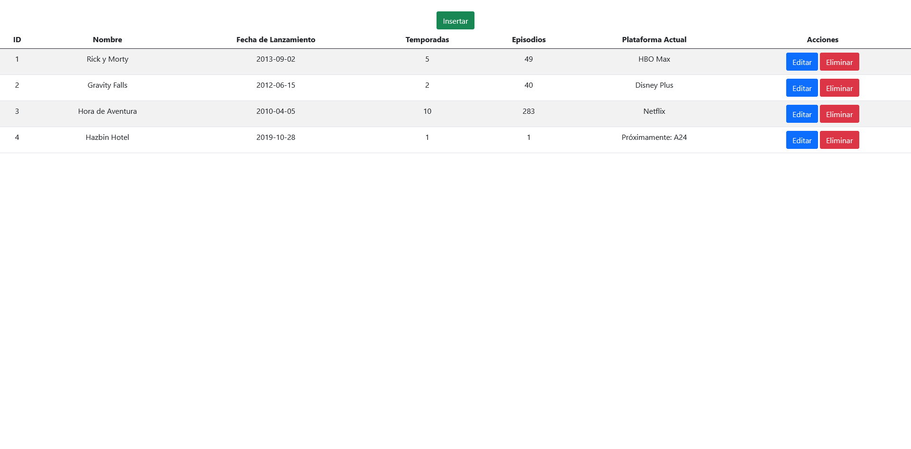

# CRUD React - PHP 

A simple CRUD using PHP for backend, MySQL for DB and React.

## Screen 1

## Screen 2

## Screen 3

## Screen 4

## Screen 5

## Screen 6

## Screen 7

## Screen 8

## Screen 9

